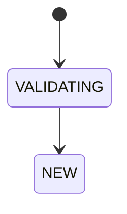
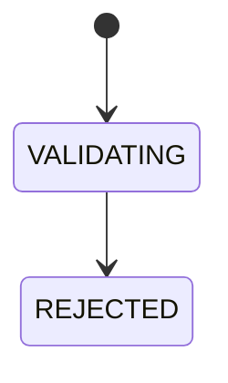
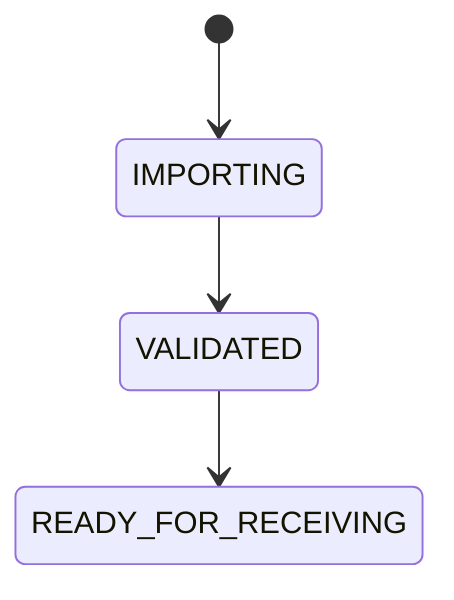
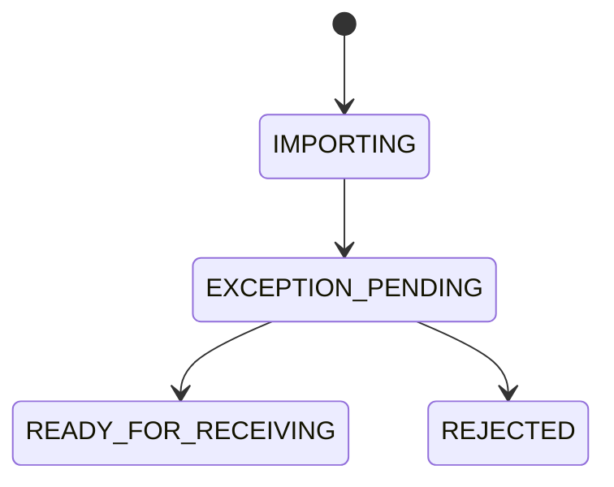
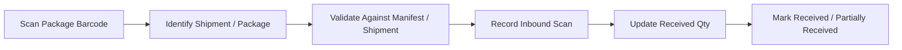
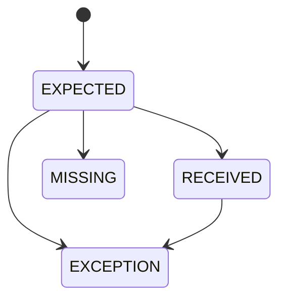
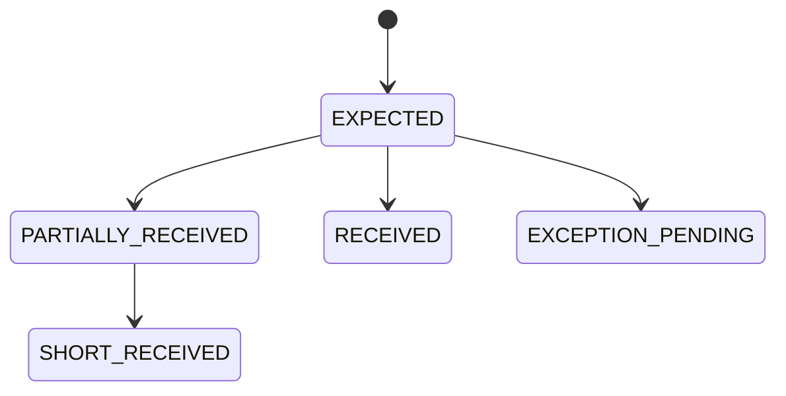

# Exception Flows

## 1. Overview

This document defines exception handling flows across the logistics platform.

The purpose of this document is to:

- Identify exception scenarios at each operational stage
- Define system detection rules
- Define automatic system actions
- Define operator resolution workflows
- Define shipment status transitions
- Ensure traceability and auditability

Exception flows are organized by business process stage.

---

## 2. Exception Lifecycle

All exceptions follow a standard lifecycle.

### Exception Status

| Status           | Description                                          |
| ---------------- | ---------------------------------------------------- |
| OPEN             | Exception detected and unresolved                    |
| IN_REVIEW        | Being investigated by operator                       |
| WAITING_EXTERNAL | Waiting for customer / driver / third-party response |
| RESOLVED         | Exception resolved                                   |
| OVERRIDDEN       | Manually overridden                                  |
| REJECTED         | Shipment or process rejected                         |

---

### Severity Levels

| Severity | Description                        |
| -------- | ---------------------------------- |
| LOW      | Informational; does not block flow |
| MEDIUM   | Requires operator attention        |
| HIGH     | Blocks operational flow            |
| CRITICAL | Requires immediate escalation      |

---

## 3. Standard Exception Record

All exceptions should be recorded in:

```sql
shipment_exception
```

Suggested structure:

```sql
id
shipment_id
exception_type
exception_status
severity
source_flow
details
detected_at
detected_by
resolved_at
resolved_by
resolution_action
resolution_note
```

---

## 4. Exception Flow Structure

Each flow section follows this structure:

### Normal Flow

Defines expected business process.

### Trigger Point

Where exception validation occurs.

### Exception Scenarios

Specific failure cases.

Each exception scenario defines:

- Description
- Detection Rule
- System Action
- Operator Action
- Resolution
- Audit Event

---

## 5. Shipment Creation / Import Flow

### 5.1 Purpose

The Shipment Creation / Import Flow validates inbound shipment data before the shipment enters downstream warehouse and delivery operations.

Shipment creation may originate from:

- Customer portal
- API integration
- CSV / Excel bulk import
- Operator manual entry

The goal is to reject or quarantine invalid shipment data before persistence.

---

### 5.2 Normal Flow


---

### Standard Processing Steps

1. Receive shipment payload
2. Validate mandatory fields
3. Validate customer account
4. Validate service type
5. Validate address information
6. Validate package data
7. Validate routing / depot assignment
8. Validate pricing rule availability
9. Generate shipment reference
10. Persist shipment
11. Generate package records
12. Emit shipment creation event

Successful outcome:

```text
Shipment Status = NEW
```

---

### 5.3 Trigger Point

Exception validation is triggered:

- Before database persistence
- During field validation
- During business rule validation
- During duplicate detection
- During pricing rule matching

---

### 5.4 Exception Scenarios

---

### SC-01 Missing Mandatory Field

#### Description

Required shipment data is missing.

#### Detection Rule

Any required field is null or empty:

- packs
- weight
- cbm
- consignor
- consignee
- chargecode
- packages

#### System Action

Create exception:

```text
Type: MISSING_REQUIRED_FIELD
Severity: HIGH
Status: REJECTED
```

Reject shipment creation.

#### Operator Resolution

N/A

#### Audit Event

```text
SHIPMENT_CREATION_EXCEPTION
```

---

### SC-02 Duplicate Shipment Reference

#### Description

Incoming shipment reference already exists.

#### Detection Rule

Existing shipment record matches incoming ref.

#### System Action

Create exception:

```text
Type: DUPLICATE_SHIPMENT_REF
Severity: HIGH
Status: REJECTED
```

Reject shipment creation.

#### Operator Resolution Options

N/A

---

### SC-03 Invalid Customer Account

#### Description

Shipment submitted by invalid customer account.

#### Detection Rule

Customer is:

- Inactive
- Suspended
- Unauthorized for service
- Invalid account reference

#### System Action

Create exception:

```text
Type: INVALID_CUSTOMER_ACCOUNT
Severity: HIGH
Status: REJECTED
```

Reject creation.

---

### SC-04 Invalid Service Type

#### Description

Requested service type is not available.

#### Detection Rule

Service type does not exist or is not permitted.

#### System Action

Create exception:

```text
Type: INVALID_SERVICE_TYPE
Severity: HIGH
Status: REJECTED
```

Reject creation.

---

### SC-05 Invalid Delivery Address

#### Description

Delivery address cannot be validated.

#### Detection Rule

Any of:

- Invalid postcode
- Suburb/postcode mismatch
- Missing address line
- Geocoding failure

#### System Action

Create exception:

```text
Type: INVALID_ADDRESS
Severity: HIGH
Status: REJECTED
```

#### Operator Resolution

N/A

---

### SC-06 Package Data Mismatch

#### Description

Package-level data is inconsistent.

#### Detection Rule

Examples:

- package_count <= 0
- negative weight
- dimension invalid
- package list count mismatch

#### System Action

Create exception:

```text
Type: PACKAGE_DATA_MISMATCH
Severity: HIGH
Status: REJECTED
```

Reject creation.

---

### SC-07 Pricing Rule Not Found

#### Description

No pricing rule matches shipment parameters.

#### Detection Rule

No pricing configuration found for:

```text
customer + charge_code + service_type + depot + destination
```

#### System Action

Create exception:

```text
Type: PRICING_RULE_NOT_FOUND
Severity: HIGH
Status: REJECTED
```

---

## 5.5 Status Transitions

### Successful Creation



---

### Exception Creation



---

## 5.6 Audit Requirements

All shipment creation exceptions must log:

- Original payload
- Validation failure reason
- Detection timestamp
- Source system

---

# 6. Manifest Flow

## 6.1 Purpose

The Manifest Flow defines how shipment manifest data is received, validated, and linked to shipment records before physical cargo arrives or before warehouse receiving scan begins.

A manifest may come from:

- Customer portal submission
- API integration
- CSV / Excel upload
- Operator manual import

The main purpose of the manifest is to provide an expected cargo list for later warehouse receiving and reconciliation.

---

## 6.2 Normal Flow


---

### Standard Processing Steps

1. Receive manifest payload
2. Validate manifest header
3. Validate manifest shipment lines
4. Match manifest lines to existing shipments
5. Link shipments to manifest batch
6. Mark manifest as ready for receiving
7. Emit manifest import event

Successful outcome:

```text
Manifest Status = READY_FOR_RECEIVING
```

---

## 6.3 Trigger Point

Manifest exceptions are triggered:

- During manifest file/API import
- During manifest line validation
- During shipment matching
- During duplicate detection
- Before manifest is released for receiving

---

## 6.4 Exception Scenarios

---

### MF-01 Invalid Manifest Header

#### Description

Manifest header data is missing or invalid.

#### Detection Rule

Any required manifest header field is missing or invalid:

- customer_id
- manifest_no
- origin
- destination_depot
- manifest_date
- expected_arrival_date

#### System Action

Create exception:

```text
Type: INVALID_MANIFEST_HEADER
Severity: HIGH
Status: REJECTED
```

Reject manifest import.

#### Operator Resolution

Correct header data and re-import manifest.

#### Audit Event

```text
MANIFEST_IMPORT_EXCEPTION
```

---

### MF-02 Duplicate Manifest Number

#### Description

Manifest number already exists for the same customer or source system.

#### Detection Rule

Existing manifest record matches:

```text
customer_id + manifest_no
```

#### System Action

Create exception:

```text
Type: DUPLICATE_MANIFEST_NO
Severity: HIGH
Status: REJECTED ?? 
```

Block duplicate manifest import.

#### Operator Resolution Options

- Reject duplicate import
- Treat as manifest update ??

---

### MF-03 Shipment Reference Not Found

#### Description

Manifest references a shipment that does not exist in the system.

#### Detection Rule

Referenced shipment.ref cannot be found.

#### System Action

Create exception:

Type: SHIPMENT_NOT_FOUND
Severity: HIGH
Status: REJECTED

Hold affected manifest line.

#### Operator Resolution

- N/A

---

### MF-04 Duplicate Shipment Line in Manifest

#### Description

The same shipment appears multiple times in one manifest.

#### Detection Rule

Duplicate shipment reference found inside the same manifest batch.

Example:

```text
manifest_id + shipment_ref appears more than once
```

#### System Action

Create exception:

```text
Type: DUPLICATE_MANIFEST_LINE
Severity: MEDIUM
Status: OPEN
```

Block duplicate line.

#### System Resolution Options

- Remove duplicate line


---

### MF-05 Shipment Already Linked to Another Active Manifest

#### Description

Shipment already belongs to another active manifest.

This may happen when customer re-uploads the same shipment in a different manifest or sends updated pre-alert data incorrectly.

#### Detection Rule

Shipment reference exists and is already linked to another manifest that is not cancelled or closed.

```text
shipment.ref exists
AND existing_manifest.status NOT IN (CANCELLED, CLOSED)
AND existing_manifest.id != current_manifest.id
```

#### System Action

Create exception:

```text
Type: SHIPMENT_ALREADY_MANIFESTED
Severity: MEDIUM
Status: OPEN
```

Hold affected shipment line for review.

#### Operator Resolution Options

- Keep original manifest link
- Move shipment to new manifest
- Treat new manifest as update
- Cancel old manifest link

---

## 6.5 Status Transitions

### Successful Manifest Import



---

### Manifest Import With Exceptions



---

## 6.6 Audit Requirements

All manifest exceptions must log:

- Original manifest payload or file reference
- Manifest number
- Customer
- Failed line numbers
- Validation failure reason
- Source system
- Operator action
- Resolution note
- Timestamp

---

## 6.7 Notes

Manifest exceptions should mainly cover declaration-level problems.

Physical cargo discrepancies should be handled in the Inbound Scan Flow, including:

- Cargo received but not in current manifest
- Cargo received without any manifest
- Manifested cargo not received
- Package quantity mismatch during receiving
- Damaged cargo found during receiving

---

# 7. Inbound Scan Flow

## 7.1 Purpose

The Inbound Scan Flow handles physical cargo receiving at warehouse.

This flow compares scanned physical packages against system shipment records and manifest declarations.

The main purpose is to detect discrepancies between:

```text
Expected Cargo
vs
Actual Received Cargo
```

Inbound scan exceptions should cover cargo-level and package-level receiving problems.

---

## 7.2 Normal Flow



---

## 7.3 Standard Processing Steps

1. Operator selects receiving context

   Examples:

   - Manifest batch
   - Depot
   - Warehouse receiving session

2. Operator/sorting line scans package barcode

3. System identifies shipment and package

4. System validates:

   - shipment exists
   - package exists
   - package belongs to selected manifest/context
   - package is not already received
   - shipment status allows inbound scan

5. System records package scan event

6. System updates package/shipment receiving quantity

7. System updates receiving status

Successful outcome:

```text
Package Status = RECEIVED
Shipment Status = PARTIALLY_RECEIVED / RECEIVED
```

---

## 7.4 Trigger Point

Inbound scan exceptions are triggered:

- At barcode scan time
- During shipment lookup
- During package lookup
- During manifest/context validation
- During duplicate scan detection
- During receiving completion reconciliation

---

## 7.5 Exception Scenarios

---

### IS-01 Barcode Not Recognized

#### Description

Scanned barcode cannot be matched to any shipment or package record.

#### Detection Rule

No package or shipment record found for scanned barcode.

#### System Action

Create exception:

```text
Type: BARCODE_NOT_RECOGNIZED
Severity: HIGH
Status: CLOSED
```

Do not record the scan as normal receiving.

#### Operator Resolution Options

- Mark as unknown cargo
- Move cargo to exception holding area

---

### IS-02 Shipment Not Manifested

#### Description

Scanned package belongs to an existing shipment, but the shipment was never manifested.

This means the shipment exists in the system, but it was not declared in any expected inbound manifest.

#### Detection Rule

```text
shipment exists
AND shipment has no active manifest link
```

#### System Action

Create exception:

```text
Type: RECEIVED_WITHOUT_MANIFEST
Severity: MEDIUM
Status: OPEN
```

Allow receiving scan.

Flag shipment for manifest review.

#### Operator Resolution Options

- Accept cargo and link to receiving session

---

### IS-03 Shipment Not in Current Manifest

#### Description

Scanned package belongs to an existing shipment and has been manifested, but not under the currently selected manifest or receiving batch.

This means the cargo is real and known, but it does not belong to the current receiving context.

#### Detection Rule

```text
shipment exists
AND shipment.manifest_id exists
AND shipment.manifest_id != current_manifest_id
```

#### System Action

Create exception:

```text
Type: RECEIVED_IN_WRONG_MANIFEST_CONTEXT
Severity: MEDIUM
Status: OPEN
```

Display expected manifest information to operator.

#### Operator Resolution Options

- Accept into current receiving session
- Switch to correct manifest and rescan

#### Notes

This is different from `RECEIVED_WITHOUT_MANIFEST`.

- `RECEIVED_WITHOUT_MANIFEST`: shipment exists but was never manifested
- `RECEIVED_IN_WRONG_MANIFEST_CONTEXT`: shipment was manifested, but not in the selected manifest

---

### IS-04 Duplicate Inbound Scan

#### Description

The same package barcode has already been scanned as received.

#### Detection Rule

```text
package.status = RECEIVED
OR existing inbound scan event exists for package barcode
```

#### System Action

Create exception or warning:

```text
Type: DUPLICATE_INBOUND_SCAN
Severity: LOW / MEDIUM
Status: OPEN
```

Do not increase received quantity again.

#### Operator Resolution Options

- Ignore duplicate scan

---

### IS-05 Partial Receiving

#### Description

Only part of the declared packages have been received.

Example:

```text
Declared package_count = 10
Received package_count = 7
```

#### Detection Rule

At receiving session close:

```text
received_package_count < declared_package_count
```

#### System Action

Create exception:

```text
Type: PARTIAL_RECEIVING
Severity: MEDIUM
Status: OPEN
```

Set shipment status:

```text
Shipment Status = PARTIALLY_RECEIVED
```

#### Operator Resolution Options

- Keep manifest open
- Mark missing packages as pending
- Confirm short-received
- Notify customer/source system
- Close receiving with shortage record

---

### IS-06 Shipment Status Invalid for Receiving

#### Description

Shipment exists but current status does not allow inbound receiving.

Examples:

- CANCELLED
- DELIVERED
- RETURNED
- ALREADY_RECEIVED
- ARCHIVED

#### Detection Rule

```text
shipment.status NOT IN allowed_receiving_statuses
```

#### System Action

Create exception:

```text
Type: INVALID_STATUS_FOR_RECEIVING
Severity: HIGH
Status: OPEN
```

Block normal receiving scan.

#### Operator Resolution Options

- Verify shipment status
- Reopen shipment under supervisor approval
- Reject scan
- Create investigation task

---

### IS-07 Wrong Depot / Warehouse

#### Description

Scanned shipment belongs to another depot or warehouse.

Example:

```text
Shipment depot = MEL
Current receiving depot = SYD
```

#### Detection Rule

```text
shipment.depot_id != current_depot_id
```

#### System Action

Create exception:

```text
Type: WRONG_DEPOT_RECEIVING
Severity: HIGH
Status: OPEN
```

Flag cargo as misrouted.

#### Operator Resolution Options

- Accept and transfer to correct depot
- Hold for cross-dock decision
- Contact customer / linehaul team
- Correct depot assignment if original routing was wrong

---

### IS-08 Damaged Cargo Found During Receiving

#### Description

Cargo is physically damaged during inbound receiving.

#### Detection Rule

Operator manually reports damage during scan.

#### System Action

Create exception:

```text
Type: DAMAGED_ON_ARRIVAL
Severity: MEDIUM / HIGH
Status: OPEN
```

Require photo evidence if available.

Set shipment/package hold flag if necessary.

#### Operator Resolution Options

- Continue receiving with damage note
- Hold cargo
- Notify customer
- Request disposal / return / inspection instruction

---

### IS-09 Barcode Format Invalid

#### Description

Barcode is readable but does not match expected barcode format.

Examples:

- missing package suffix
- invalid check digit
- malformed reference
- unsupported carrier barcode

#### Detection Rule

Barcode parser fails validation.

#### System Action

Create exception:

```text
Type: INVALID_BARCODE_FORMAT
Severity: MEDIUM
Status: OPEN
```

Do not attach scan to shipment automatically.

#### Operator Resolution Options

- Manual shipment lookup
- Relabel package
- Correct barcode mapping
- Hold cargo for review

---

### IS-10 Package Already Received in Another Session

#### Description

Package has already been received in a previous receiving session.

This may indicate duplicate scan, duplicate physical label, or cargo being moved between receiving areas.

#### Detection Rule

```text
existing inbound scan event exists
AND existing receiving_session_id != current_receiving_session_id
```

#### System Action

Create exception:

```text
Type: PACKAGE_RECEIVED_IN_OTHER_SESSION
Severity: MEDIUM
Status: OPEN
```

Display previous scan session, operator, and timestamp.

#### Operator Resolution Options

- Ignore current scan
- Move package to correct location
- Confirm duplicate physical cargo
- Escalate for investigation

---

## 7.6 Receiving Completion Reconciliation

When operator closes a receiving session, system should reconcile:

```text
manifest expected shipments/packages
vs
actual scanned shipments/packages
```

Possible outcomes:

| Outcome | Description |
|---------|-------------|
| COMPLETE | All expected packages received |
| PARTIAL | Some expected packages missing |
| EXTRA_RECEIVED | Extra packages received |
| EXCEPTION_PENDING | One or more unresolved exceptions exist |

---

## 7.7 Status Transitions

### Package Level



---

### Shipment Level



---

## 7.8 Audit Requirements

All inbound scan exceptions must log:

- Scanned barcode
- Shipment ID if matched
- Package ID if matched
- Manifest ID if applicable
- Receiving session ID
- Depot / warehouse
- Operator
- Scan timestamp
- Exception type
- Resolution action
- Resolution note

---

## 7.9 Notes

Inbound scan exceptions should focus on physical receiving discrepancies.

Manifest-level declaration problems should remain in the Manifest Flow.

Delivery driver pickup problems should be handled later in the Driver Pickup Flow.

---

# 8. Warehouse Processing Flow

_To be defined._

---

# 9. Delivery Assignment Flow

_To be defined._

---

# 10. Driver Pickup Flow

_To be defined._

---

# 11. Delivery / POD Flow

_To be defined._

---

# 12. Billing / Invoice Flow

_To be defined._
