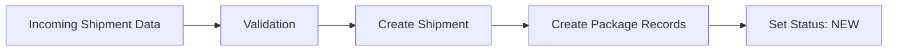
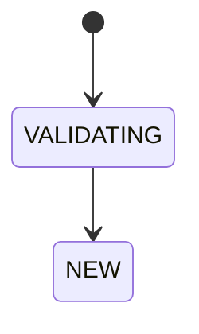
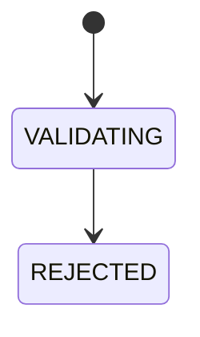

# Exception Flows

## 1. Overview

This document defines exception handling flows across the logistics platform.

The purpose of this document is to:

- Identify exception scenarios at each operational stage
- Define system detection rules
- Define automatic system actions
- Define operator resolution workflows
- Define shipment status transitions
- Ensure traceability and auditability

Exception flows are organized by business process stage.

---

## 2. Exception Lifecycle

All exceptions follow a standard lifecycle.

### Exception Status

| Status | Description |
|--------|-------------|
| OPEN | Exception detected and unresolved |
| IN_REVIEW | Being investigated by operator |
| WAITING_EXTERNAL | Waiting for customer / driver / third-party response |
| RESOLVED | Exception resolved |
| OVERRIDDEN | Manually overridden |
| REJECTED | Shipment or process rejected |

---

### Severity Levels

| Severity | Description |
|----------|-------------|
| LOW | Informational; does not block flow |
| MEDIUM | Requires operator attention |
| HIGH | Blocks operational flow |
| CRITICAL | Requires immediate escalation |

---

## 3. Standard Exception Record

All exceptions should be recorded in:

```sql
shipment_exception
```

Suggested structure:

```sql
id
shipment_id
exception_type
exception_status
severity
source_flow
details
detected_at
detected_by
resolved_at
resolved_by
resolution_action
resolution_note
```

---

## 4. Exception Flow Structure

Each flow section follows this structure:

### Normal Flow
Defines expected business process.

### Trigger Point
Where exception validation occurs.

### Exception Scenarios
Specific failure cases.

Each exception scenario defines:

- Description
- Detection Rule
- System Action
- Operator Action
- Resolution
- Audit Event

---

## 5. Shipment Creation / Import Flow

### 5.1 Purpose

The Shipment Creation / Import Flow validates inbound shipment data before the shipment enters downstream warehouse and delivery operations.

Shipment creation may originate from:

- Customer portal
- API integration
- CSV / Excel bulk import
- Operator manual entry

The goal is to reject or quarantine invalid shipment data before persistence.

---

### 5.2 Normal Flow



---

### Standard Processing Steps

1. Receive shipment payload
2. Validate mandatory fields
3. Validate customer account
4. Validate service type
5. Validate address information
6. Validate package data
7. Validate routing / depot assignment
8. Validate pricing rule availability
9. Generate shipment reference
10. Persist shipment
11. Generate package records
12. Emit shipment creation event

Successful outcome:

```text
Shipment Status = NEW
```

---

### 5.3 Trigger Point

Exception validation is triggered:

- Before database persistence
- During field validation
- During business rule validation
- During duplicate detection
- During pricing rule matching

---

### 5.4 Exception Scenarios

---

### SC-01 Missing Mandatory Field

#### Description

Required shipment data is missing.

#### Detection Rule

Any required field is null or empty:

- packs
- weight
- cbm
- consignor
- consignee
- chargecode
- packages

#### System Action

Create exception:

```text
Type: MISSING_REQUIRED_FIELD
Severity: HIGH
Status: REJECTED
```

Reject shipment creation.

#### Operator Resolution

N/A

#### Audit Event

```text
SHIPMENT_CREATION_EXCEPTION
```

---

### SC-02 Duplicate Shipment Reference

#### Description

Incoming shipment reference already exists.

#### Detection Rule

Existing shipment record matches incoming ref.

#### System Action

Create exception:

```text
Type: DUPLICATE_SHIPMENT_REF
Severity: HIGH
Status: REJECTED
```

Reject shipment creation.

#### Operator Resolution Options

N/A

---

### SC-03 Invalid Customer Account

#### Description

Shipment submitted by invalid customer account.

#### Detection Rule

Customer is:

- Inactive
- Suspended
- Unauthorized for service
- Invalid account reference

#### System Action

Create exception:

```text
Type: INVALID_CUSTOMER_ACCOUNT
Severity: HIGH
Status: REJECTED
```

Reject creation.

---

### SC-04 Invalid Service Type

#### Description

Requested service type is not available.

#### Detection Rule

Service type does not exist or is not permitted.

#### System Action

Create exception:

```text
Type: INVALID_SERVICE_TYPE
Severity: HIGH
Status: REJECTED
```

Reject creation.

---

### SC-05 Invalid Delivery Address

#### Description

Delivery address cannot be validated.

#### Detection Rule

Any of:

- Invalid postcode
- Suburb/postcode mismatch
- Missing address line
- Geocoding failure

#### System Action

Create exception:

```text
Type: INVALID_ADDRESS
Severity: HIGH
Status: REJECTED
```

#### Operator Resolution

N/A

---

### SC-06 Package Data Mismatch

#### Description

Package-level data is inconsistent.

#### Detection Rule

Examples:

- package_count <= 0
- negative weight
- dimension invalid
- package list count mismatch

#### System Action

Create exception:

```text
Type: PACKAGE_DATA_MISMATCH
Severity: HIGH
Status: REJECTED
```

Reject creation.

---

### SC-07 Pricing Rule Not Found

#### Description

No pricing rule matches shipment parameters.

#### Detection Rule

No pricing configuration found for:

```text
customer + charge_code + service_type + depot + destination
```

#### System Action

Create exception:

```text
Type: PRICING_RULE_NOT_FOUND
Severity: HIGH
Status: REJECTED
```

---

## 5.5 Status Transitions

### Successful Creation



---

### Exception Creation



---

## 5.6 Audit Requirements

All shipment creation exceptions must log:

- Original payload
- Validation failure reason
- Detection timestamp
- Source system


---

# 6. Manifest Flow

_To be defined._

---

# 7. Inbound Scan Flow

_To be defined._

---

# 8. Warehouse Processing Flow

_To be defined._

---

# 9. Delivery Assignment Flow

_To be defined._

---

# 10. Driver Pickup Flow

_To be defined._

---

# 11. Delivery / POD Flow

_To be defined._

---

# 12. Billing / Invoice Flow

_To be defined._